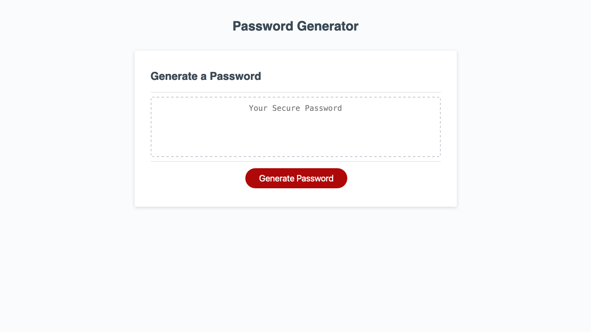

# Challenge-3

## Description

Having a secure password to protect your data is as important as ever, and this password generator is a great help to that end. Made with JavaScript, it allows the user to select from multiple options to create a completely random password with various letters, number, and symbols.

## Usage

Deployed website: [https://sgsetts.github.io/Challenge-3/](https://sgsetts.github.io/Challenge-3/)

## License

MIT License